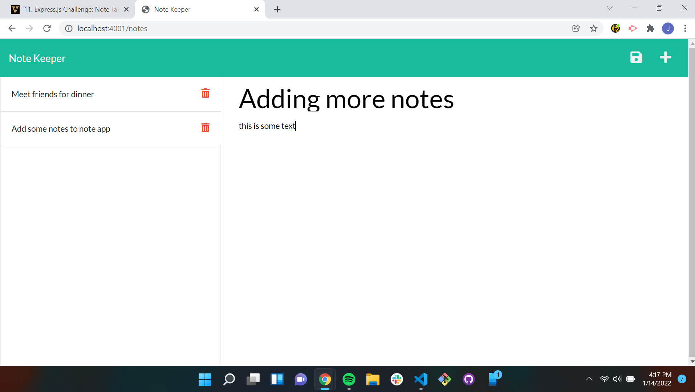

# Note Keeper

## Description

Note Keeper is a simple note taking application made using express.js.  Once a note is entered using the save button at the top right corner you will have the ability to save the  note to the list located on the left of the page.  The list on the left does have the ability to delete notes by clicking the trash can next to the note.

## Installation

git clone <src>, then "npm install" to install necessary dependancies. You can start the application for the terminal using the command "npm start".  It will be hosted at http://localhost:4001

## Screenshots

## Links

GitHub Repo: https://github.com/JMaurizio/Note-Keeper

Herkou URL: https://immense-forest-27480.herokuapp.com/